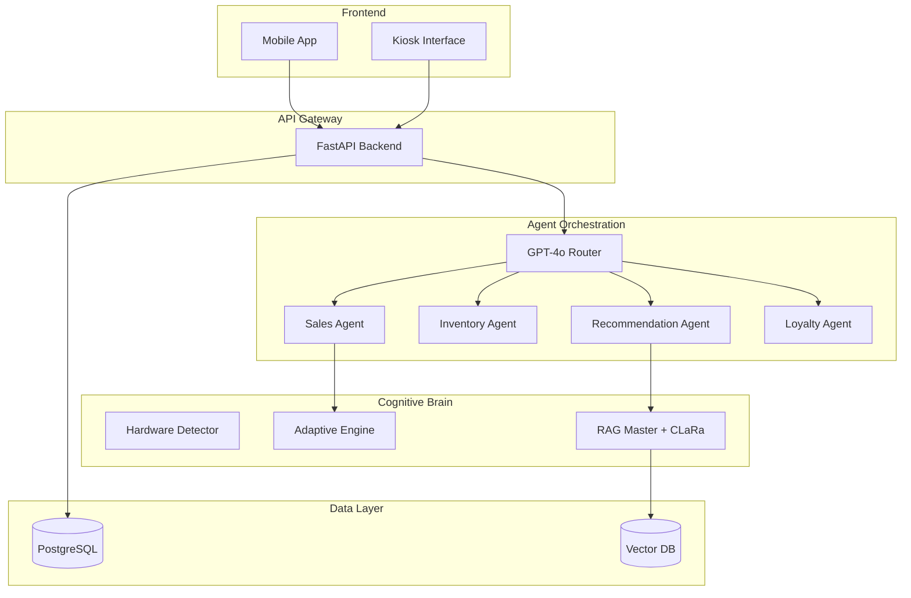
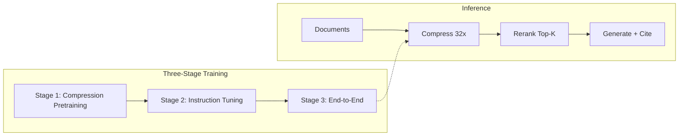

<div align="center">

# 🧠 Cognitive Retail Brain

### Agentic AI for Seamless Omnichannel Retail

[](.)
[](.)
[](https://arxiv.org/abs/2511.18659)
[](LICENSE)

*A hyperscale, multi-agent AI system that bridges the "context gap" in omnichannel retail, powered by CLaRa's state-of-the-art document compression and adaptive hardware scaling.*

[Quick Start](#-quick-start) • [Architecture](#-architecture) • [LLM Hosting](#-llm-hosting) • [Training](#-training) • [Docs](#-documentation)

</div>

---

## 📖 Overview

The **Cognitive Retail Brain** is an advanced multi-agent AI system designed to solve the "context gap" in omnichannel retail. It enables seamless customer journeys by maintaining conversation history and preferences across different touchpoints (Mobile App → In-Store Kiosk).

### Key Innovations

| Feature | Description |
|---------|-------------|
| 🤖 **Multi-Agent Orchestration** | Hub-and-spoke architecture with GPT-4o Router and specialized sub-agents |
| 🔗 **Seamless Context Handover** | QR-based session transfer from Mobile to Kiosk |
| 🧪 **CLaRa RAG Integration** | 32-64x document compression with unified retrieval-generation |
| ⚡ **Adaptive LLM Hosting** | Auto-scales from CPU to datacenter GPUs |
| 🧠 **Hardware-Aware Scaling** | "Brain power" increases with GPU resources |

---

## ✨ Features

### Core Capabilities
- **Multi-Agent Architecture**: GPT-4o Router orchestrates Sales, Inventory, Recommendation, and Loyalty agents
- **Persistent Memory**: PostgreSQL stores sessions, cart items, and conversation history
- **Local Model Hosting**: Fine-tuned Mistral-7B, StarCoder2, and NLLB-200 models
- **Modern UI**: React + TypeScript + Tailwind CSS for Mobile and Kiosk interfaces

### CLaRa-Powered RAG
- **Document Compression**: 32x-64x compression while preserving semantic content
- **Three-Stage Training**: Compression Pretraining → Instruction Tuning → End-to-End
- **Unified Optimization**: Joint retrieval and generation in shared latent space
- **Citation Grounding**: Automatic source attribution for responses

### Adaptive Hardware Scaling

```
┌─────────────────────────────────────────────────────────────────────┐
│                    HARDWARE TIER SCALING                            │
├──────────────┬──────────┬─────────────┬───────────┬────────────────┤
│ Tier         │ VRAM     │ Backend     │ Batch     │ Context        │
├──────────────┼──────────┼─────────────┼───────────┼────────────────┤
│ CPU Only     │ N/A      │ llama.cpp   │ 1         │ 2,048          │
│ Low VRAM     │ <8GB     │ llama.cpp   │ 1         │ 4,096          │
│ Consumer     │ 8-12GB   │ vLLM        │ 8         │ 8,192          │
│ Prosumer     │ 12-24GB  │ vLLM        │ 32        │ 16,384         │
│ Datacenter   │ 24GB+    │ vLLM        │ 128       │ 32,768         │
└──────────────┴──────────┴─────────────┴───────────┴────────────────┘
```

---

## 🚀 Quick Start

### Prerequisites
- Docker & Docker Compose
- OpenAI API Key (for GPT-4o Router)
- NVIDIA GPU (optional, for local model hosting)

### Installation

```bash
# 1. Clone the repository
git clone <repo-url>
cd seamless-retail

# 2. Configure environment
cp .env.example .env
# Edit .env with your API keys:
#   OPENAI_API_KEY=sk-your-key-here
#   POSTGRES_USER=postgres
#   POSTGRES_PASSWORD=password
#   POSTGRES_DB=retail_brain

# 3. Run with Docker
docker-compose up --build

# 4. Access the application
#    Mobile App: http://localhost:8000
#    Kiosk: http://localhost:8000/kiosk
#    API Docs: http://localhost:8000/docs
```

### Local Model Hosting (Optional)

```bash
# Detect hardware and configure automatically
python -m cognitive_brain.core.hardware_detector

# Start optimized LLM server
python scripts/hosting/serve_optimized.py --port 8001

# Or use the batch script (Windows)
scripts/hosting/run_host_optimized.bat
```

---

## 🏗️ Architecture

### System Overview



### CLaRa RAG Pipeline



### Agent Workflow

1. **Mobile**: User asks "Do you have a blue suit?" → Sales Agent → Inventory Agent → Response
2. **Handover**: User opens App → Generates QR (Session ID)
3. **Kiosk**: User scans QR → Context retrieved → Recommendation Agent suggests matching shoes

---

## 🖥️ LLM Hosting

The Cognitive Brain automatically detects hardware and configures optimal inference:

### Supported Backends

| Backend | Use Case | Requirements |
|---------|----------|--------------|
| **vLLM** | High-throughput serving | CUDA, ≥8GB VRAM |
| **llama.cpp** | CPU/low VRAM inference | Any hardware |
| **PyTorch** | Custom models, fine-tuning | GPU recommended |
| **Triton** | Vision models (YOLO) | NVIDIA GPU |

### Hardware Detection

```python
from cognitive_brain.core.hardware_detector import HardwareDetector

detector = HardwareDetector()
detector.print_summary()

# Output:
# ============================================================
#   COGNITIVE BRAIN - HARDWARE DETECTION REPORT
# ============================================================
#   Hardware Tier: CONSUMER
#   Backend: vllm
#   Quantization: awq
#   Max Batch Size: 8
#   BRAIN POWER SCORE: 🧠🧠 80 (Consumer)
# ============================================================
```

### Model Registry

| Model | Purpose | VRAM (AWQ) | VRAM (FP16) |
|-------|---------|------------|-------------|
| Mistral-7B-Instruct | Language & Reasoning | 4.5 GB | 14 GB |
| StarCoder2-3B | Code Generation | 2.0 GB | 6 GB |
| NLLB-200 | Translation | 3.0 GB | 8 GB |
| CLaRa-7B | RAG Compression | 4.5 GB | 14 GB |

📚 **Full Guide**: [docs/LLM_HOSTING_GUIDE.md](docs/LLM_HOSTING_GUIDE.md)

---

## 🎓 Training

### Supported Fine-Tuning

| Agent | Base Model | Method | Context |
|-------|------------|--------|---------|
| Language & Reasoning | Mistral-7B | QLoRA | 8192 |
| Code Generation | StarCoder2-3B | QLoRA | 8192 |
| Translation | NLLB-200 | Full Fine-tune | 512 |
| RAG Compression | Mistral-7B | CLaRa 3-Stage | 2048 |

### Quick Training

```bash
# Code Agent (StarCoder2-3B)
python scripts/training/train_code_agent.py \
    --model_name bigcode/starcoder2-3b \
    --output_dir trained_models/code_agent

# Translation Agent (NLLB-200)
python scripts/training/train_nllb_translation.py \
    --model_name facebook/nllb-200-distilled-600M

# CLaRa Training (3 Stages)
cd ml-clara-main
bash scripts/train_pretraining.sh          # Stage 1
bash scripts/train_instruction_tuning.sh   # Stage 2
bash scripts/train_stage_end_to_end.sh     # Stage 3
```

📚 **Full Guide**: [docs/TRAINING_GUIDE.md](docs/TRAINING_GUIDE.md)

---

## 📚 Documentation

| Document | Description |
|----------|-------------|
| [Project Overview](docs/project_overview.md) | Architecture and design philosophy |
| [User Guide](docs/user_guide.md) | Step-by-step demo walkthrough |
| [LLM Hosting Guide](docs/LLM_HOSTING_GUIDE.md) | Complete hosting documentation |
| [CLaRa Integration](docs/CLARA_INTEGRATION.md) | RAG compression architecture |
| [Hardware Requirements](docs/HARDWARE_REQUIREMENTS.md) | Scaling from CPU to datacenter |
| [Training Guide](docs/TRAINING_GUIDE.md) | Model fine-tuning specifications |
| [Training Specs](docs/training_specs/) | Per-agent hyperparameters |

---

## 📂 Directory Structure

```
seamless-retail/
├── agents/                 # LangGraph agent definitions
├── app/                    # FastAPI application
│   ├── api/                # REST endpoints
│   ├── core/               # Configuration
│   ├── db/                 # Database schema
│   └── services/           # Business logic
├── cognitive_brain/        # Adaptive inference engine
│   ├── core/               # Hardware detection
│   ├── inference/          # vLLM, llama.cpp, PyTorch backends
│   └── orchestration/      # Model orchestration
├── docs/                   # Documentation
├── frontend/               # React application
├── infra/                  # Docker, Helm, K8s configs
├── ml-clara-main/          # CLaRa RAG implementation
├── models/                 # Local LLM weights
├── scripts/
│   ├── hosting/            # LLM serving scripts
│   └── training/           # Fine-tuning scripts
└── trained_models/         # Fine-tuned adapters
```

---

## 🛠️ Tech Stack

| Layer | Technologies |
|-------|--------------|
| **Backend** | FastAPI, LangGraph, LangChain, SQLAlchemy |
| **Frontend** | React, Vite, TypeScript, Tailwind CSS |
| **Database** | PostgreSQL, Vector DB (planned) |
| **AI/ML** | OpenAI GPT-4o, Mistral, StarCoder2, CLaRa |
| **Inference** | vLLM, llama.cpp, PyTorch, Triton |
| **Infrastructure** | Docker, Docker Compose, Kubernetes |

---

## 🧪 Verification

Run these commands to verify your setup:

```bash
# Hardware detection
python -m cognitive_brain.core.hardware_detector

# Adaptive engine test
python -m cognitive_brain.inference.adaptive_engine

# Full verification
python scripts/verify_llm_hosting.py
```

---

## 🤝 Contributing

Contributions are welcome! Please read the documentation and follow the code style.

1. Fork the repository
2. Create a feature branch
3. Submit a pull request

---

## 📄 License

MIT License - See [LICENSE](LICENSE) for details.

---

## 🙏 Acknowledgments

- **CLaRa**: [Apple ML Research](https://arxiv.org/abs/2511.18659) for the document compression framework
- **OpenRLHF**: Training framework foundation
- **vLLM**: High-throughput LLM serving
- **LangGraph**: Agent orchestration

---

<div align="center">

**Built with 🧠 for the EY Techathon 6.0**

</div>
