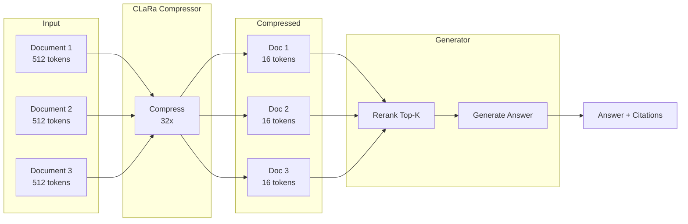
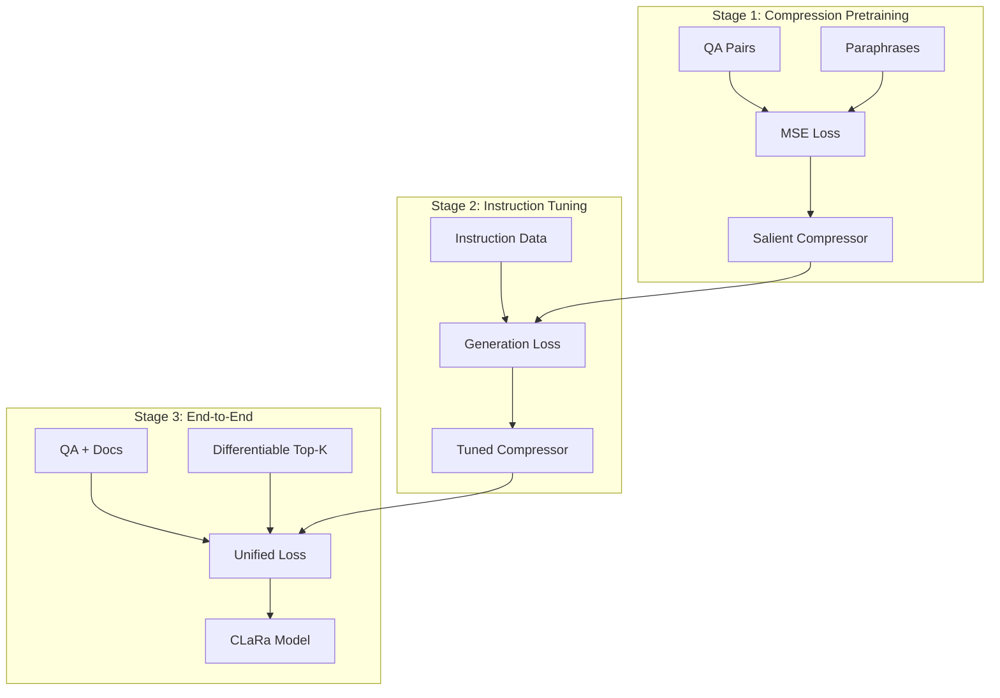

# CLaRa Integration Guide

> Continuous Latent Reasoning for Retrieval-Augmented Generation

---

## Table of Contents

- [Overview](#overview)
- [What is CLaRa?](#what-is-clara)
- [Three-Stage Training](#three-stage-training)
- [Architecture](#architecture)
- [Integration with Cognitive Brain](#integration-with-cognitive-brain)
- [Inference](#inference)
- [Performance](#performance)
- [Model Links](#model-links)

---

## Overview

**CLaRa** (Continuous Latent Reasoning) is a state-of-the-art Retrieval-Augmented Generation (RAG) framework that bridges traditional retrieval and generation through document compression. It achieves **32-64x compression** while preserving semantic content, enabling efficient RAG at scale.

### Why CLaRa?

| Challenge | Traditional RAG | CLaRa Solution |
|-----------|----------------|----------------|
| Long contexts | Slow, expensive | 32-64x compression |
| Disjoint optimization | Separate retrieval/generation | Unified training |
| Semantic loss | Surface pattern bias | QA-based supervision |
| Double encoding | Redundant compute | Shared latent space |

---

## What is CLaRa?

CLaRa introduces a three-stage training approach that progressively learns to:

1. **Compress** documents into dense latent representations
2. **Tune** compression for instruction-following tasks
3. **Unify** retrieval and generation in an end-to-end framework

### Key Innovations

```
┌───────────────────────────────────────────────────────────────────────┐
│                        CLaRa INNOVATIONS                              │
├───────────────────────────────────────────────────────────────────────┤
│                                                                       │
│  🔹 Salient Compression Pretraining (SCP)                            │
│     → QA-based and paraphrase-guided supervision                     │
│     → Retains key semantics, not surface patterns                    │
│                                                                       │
│  🔹 Compression Instruction Tuning                                   │
│     → Fine-tune on downstream QA tasks                               │
│     → Ensures compressed representations are task-relevant           │
│                                                                       │
│  🔹 Differentiable Top-K Estimator                                   │
│     → Jointly trains reranker and generator                          │
│     → Single language modeling loss unifies retrieval + generation   │
│                                                                       │
└───────────────────────────────────────────────────────────────────────┘
```

---

## Three-Stage Training

### Stage 1: Compression Pretraining

Train the document compressor using the SCP (Salient Compression Pretraining) framework.

```python
# Data format for Stage 1
{
    "data_type": "qa",
    "question": ["What is the return policy?", "How do I track my order?"],
    "answers": ["30-day money back guarantee", "Use order number on tracking page"],
    "docs": ["Our return policy allows 30-day...", "Track your order at..."]
}
```

**Key Parameters:**
| Parameter | Value | Description |
|-----------|-------|-------------|
| `compress_rate` | 32 | Compression ratio (32x) |
| `doc_max_length` | 256 | Max document tokens |
| `learning_rate` | 1e-4 | Training LR |
| `max_len` | 2048 | Max sequence length |
| `mse_loss` | true | Align compressed/original |
| `qa_loss` | true | Preserve semantics |

**Training Command:**
```bash
cd ml-clara-main
bash scripts/train_pretraining.sh
```

---

### Stage 2: Compression Instruction Tuning

Fine-tune the compressor on instruction-following tasks.

```python
# Data format for Stage 2
{
    "question": "What is your shipping policy for international orders?",
    "docs": ["International shipping takes 7-14 days...", "Customs fees may apply..."],
    "gold_answer": "International orders ship in 7-14 days. Customs fees are the buyer's responsibility.",
    "answer": "We ship internationally within 7-14 business days..."
}
```

**Key Parameters:**
| Parameter | Value | Description |
|-----------|-------|-------------|
| `pretrain_checkpoint` | stage1/model | Path to Stage 1 |
| `generation_top_k` | 5 | Top-K for generation |
| `do_eval_gen` | true | Enable evaluation |

**Training Command:**
```bash
bash scripts/train_instruction_tuning.sh
```

---

### Stage 3: End-to-End Fine-tuning

Jointly train reranker and generator with differentiable top-k.

```python
# Data format for Stage 3
{
    "question": "Does the navy blazer come in size 42?",
    "docs": [
        "Navy blazer available in sizes 38-46...",
        "Slim fit wool blend construction...",
        "Free shipping on orders over $100..."
    ],
    "gold_answer": "Yes, the navy blazer is available in size 42."
}
```

**Key Parameters:**
| Parameter | Value | Description |
|-----------|-------|-------------|
| `pretrain_checkpoint` | stage2/model | Path to Stage 2 |
| `learning_rate` | 5e-6 | Lower LR for fine-tuning |
| `max_len` | 1024 | Reduced for efficiency |

**Training Command:**
```bash
bash scripts/train_stage_end_to_end.sh
```

---

## Architecture

### Document Compression Flow



### Training Stages



---

## Integration with Cognitive Brain

### RAG Master Pipeline

CLaRa integrates into the Cognitive Brain's RAG Master for enhanced retrieval:

```python
from cognitive_brain.orchestration.rag_master import RAGMaster
from transformers import AutoModel

# Load CLaRa model
clara_model = AutoModel.from_pretrained(
    "apple/CLaRa-7B-E2E",
    trust_remote_code=True
).to('cuda')

# Initialize RAG Master with CLaRa
rag_master = RAGMaster(
    compression_model=clara_model,
    compression_rate=32,
    top_k=5
)

# Query processing
response, citations = rag_master.query(
    question="What's the price for the leather jacket?",
    documents=product_catalog
)
```

### Hybrid Retrieval Strategy

```
┌─────────────────────────────────────────────────────────────────────┐
│                      RAG MASTER + CLaRa                             │
├─────────────────────────────────────────────────────────────────────┤
│                                                                     │
│  1. HYBRID RETRIEVAL                                                │
│     ├─ BM25 (Sparse) ────────┐                                     │
│     │       top-25           │                                     │
│     └─ Dense Embeddings ─────┼──▶ Union ──▶ 50 candidates          │
│            top-12            │                                     │
│                                                                     │
│  2. CLaRa COMPRESSION                                               │
│     └─ 50 docs × 512 tokens ──▶ 50 docs × 16 tokens (32x)          │
│                                                                     │
│  3. RERANKING (Differentiable Top-K)                               │
│     └─ Select top-5 compressed documents                           │
│                                                                     │
│  4. GENERATION + CITATION                                           │
│     └─ Generate answer with source attribution                      │
│                                                                     │
└─────────────────────────────────────────────────────────────────────┘
```

### Configuration

```yaml
# cognitive_brain/config/rag_config.yaml
rag_master:
  compression:
    enabled: true
    model: "apple/CLaRa-7B-E2E"
    rate: 32
  retrieval:
    dense_top_k: 12
    sparse_top_k: 25
    fusion: "union"
  reranking:
    top_k: 5
    min_score: 0.55
  generation:
    max_new_tokens: 256
    temperature: 0.7
  guardrails:
    allow_out_of_context: false
    require_citations: true
```

---

## Inference

### Stage 1 Model (Paraphrase Generation)

```python
from transformers import AutoModel

model = AutoModel.from_pretrained(
    "apple/CLaRa-7B-Base",
    trust_remote_code=True
).to('cuda')

documents = [
    ["Return policy: 30-day money-back guarantee...",
     "Shipping: Free over $50..."]
]
questions = [""]  # Empty for paraphrase

output = model.generate_from_paraphrase(
    questions=questions,
    documents=documents,
    max_new_tokens=64
)
print("Paraphrase:", output[0])
```

### Stage 2 Model (QA from Compressed Docs)

```python
model = AutoModel.from_pretrained(
    "apple/CLaRa-7B-Instruct",
    trust_remote_code=True
).to('cuda')

documents = [
    ["The leather jacket is priced at $299...",
     "Available in sizes S, M, L, XL..."]
]
questions = ["What sizes is the leather jacket available in?"]

output = model.generate_from_text(
    questions=questions,
    documents=documents,
    max_new_tokens=64
)
print("Answer:", output[0])
```

### Stage 3 Model (End-to-End with Retrieval)

```python
model = AutoModel.from_pretrained(
    "apple/CLaRa-7B-E2E",
    trust_remote_code=True
).to('cuda')

# 20 candidate documents
documents = [
    ["Doc about jackets...", "Doc about pants...", "..."]  # 20 docs
]
questions = ["Do you have the navy blazer in size 42?"]

# Returns answer + selected document indices
output, topk_indices = model.generate_from_questions(
    questions=questions,
    documents=documents,
    max_new_tokens=64
)

print("Answer:", output[0])
print("Used documents:", topk_indices)
```

---

## Performance

### Compression Results

| Model | Compression | NQ | HotpotQA | MuSiQue | 2Wiki | Avg |
|-------|-------------|-----|----------|---------|-------|-----|
| Mistral-7B (text) | 1x | 54.58 | 42.94 | 8.94 | 44.24 | 37.67 |
| LLMLingua-2 | 4x | 47.53 | 37.05 | 9.02 | 44.35 | 34.49 |
| PISCO | 16x | 54.39 | 41.94 | 10.09 | 44.88 | 37.83 |
| **CLaRa** | **4x** | **57.05** | **45.09** | **10.34** | **46.94** | **39.86** |
| **CLaRa** | **16x** | **55.56** | **43.72** | **10.55** | **46.00** | **38.96** |
| **CLaRa** | **32x** | **54.64** | **43.52** | **10.55** | **46.58** | **38.82** |

### Key Findings

✅ CLaRa outperforms PISCO by **+1.13%** on average  
✅ CLaRa outperforms LLMLingua-2 by **+5.37%** on average  
✅ CLaRa at **32x compression** matches text-based baseline performance  
✅ Unified training improves both retrieval and generation  

### Latency Comparison

| Method | Docs | Context Length | Time to First Token |
|--------|------|----------------|---------------------|
| Standard RAG | 5 | 2560 tokens | 150ms |
| CLaRa 32x | 5 | 80 tokens | 45ms |
| Standard RAG | 20 | 10240 tokens | 800ms |
| CLaRa 32x | 20 | 320 tokens | 120ms |

---

## Model Links

### Pre-trained Models

| Model | Stage | Link |
|-------|-------|------|
| CLaRa-7B-Base | Stage 1 | [HuggingFace](https://huggingface.co/apple/CLaRa-7B-Base) |
| CLaRa-7B-Instruct | Stage 2 | [HuggingFace](https://huggingface.co/apple/CLaRa-7B-Instruct) |
| CLaRa-7B-E2E | Stage 3 | [HuggingFace](https://huggingface.co/apple/CLaRa-7B-E2E) |

### Training Data

| Dataset | Link |
|---------|------|
| CLaRa Multi-Stage | [HuggingFace](https://huggingface.co/datasets/apple/CLaRa_multi_stage) |

### Paper

- **Title**: CLaRa: Bridging Retrieval and Generation with Continuous Latent Reasoning
- **arXiv**: [2511.18659](https://arxiv.org/abs/2511.18659)
- **Authors**: Jie He, Richard He Bai, Sinead Williamson, Jeff Z. Pan, Navdeep Jaitly, Yizhe Zhang

---

## Citation

```bibtex
@misc{he2025clarabridgingretrievalgeneration,
      title={CLaRa: Bridging Retrieval and Generation with Continuous Latent Reasoning}, 
      author={Jie He and Richard He Bai and Sinead Williamson and Jeff Z. Pan and Navdeep Jaitly and Yizhe Zhang},
      year={2025},
      eprint={2511.18659},
      archivePrefix={arXiv},
      primaryClass={cs.CL},
      url={https://arxiv.org/abs/2511.18659}, 
}
```

---

## Next Steps

- [LLM Hosting Guide](LLM_HOSTING_GUIDE.md) - Deploy CLaRa models
- [Training Guide](TRAINING_GUIDE.md) - Full training pipeline
- [Hardware Requirements](HARDWARE_REQUIREMENTS.md) - VRAM needs for CLaRa
