# Cognitive Retail Brain - Gold Standard Architecture

## Executive Summary
A **local-first, self-hosted** hyperscale neural ecosystem for retail AI. No cloud dependencies - runs entirely on-premise with Docker Compose.

---

## Architecture Diagram (Mermaid.js)


---

## Component Architecture

### Layer 1: Sensory Cortex (Input Processing)
| Component | Technology | Purpose |
|-----------|------------|---------|
| Visual Pathway | YOLOv9 (ONNX/TensorRT) | Shelf analysis, product detection |
| Audio Pathway | Whisper (local) | Voice commands, sentiment |
| Digital Pathway | FastAPI + Kafka | REST/WebSocket events |

### Layer 2: Hippocampus (Memory & Context)
| Component | Technology | Purpose |
|-----------|------------|---------|
| Vector Store | ChromaDB / FAISS | Semantic search, embeddings |
| Knowledge Graph | Neo4j (local) | Product relationships |
| Session Cache | Redis | Sub-ms session retrieval |

### Layer 3: Cerebellum (Model Factory)
| Component | Technology | Purpose |
|-----------|------------|---------|
| Training Pipeline | QLoRA + PEFT | Fine-tuning on retail data |
| Experiment Tracking | MLflow | Hyperparameter logging |
| Data Drift Detection | Custom monitors | Trigger retraining |

### Layer 4: Frontal Cortex (Reasoning)
| Lobe | Model | Specialization |
|------|-------|----------------|
| Meta Router | DistilBERT classifier | Intent routing |
| Inventory Lobe | TFT (Temporal Fusion) | Demand forecasting |
| Empathy Lobe | Mistral-7B-Retail | Customer chat |
| Visual Lobe | CLIP | Visual search |
| Code Lobe | StarCoder2-3B | Code generation |

### Layer 5: Synapse (Inference)
| Engine | Use Case | Latency Target |
|--------|----------|----------------|
| NVIDIA Triton | Vision models, ensembles | <50ms |
| vLLM | High-throughput LLM | <200ms |
| llama.cpp | Edge/CPU inference | <500ms |

---

## Inference Flow Diagram


---

## Data Flow Architecture

```mermaid
flowchart LR
    subgraph INPUT["📥 Data Sources"]
        API[REST API]
        WS[WebSocket]
        CSV[Batch CSV]
    end

    subgraph PROCESS["⚙️ Processing"]
        KAFKA[Message Queue]
        SPARK[PySpark ETL]
        FEAT[Feature Store]
    end

    subgraph STORE["💾 Storage"]
        DELTA[Delta Lake<br/>Parquet]
        VECTOR[Vector DB]
        SQL[PostgreSQL]
    end

    subgraph ML["🤖 ML Pipeline"]
        TRAIN[Training]
        SERVE[Inference]
    end

    API --> KAFKA
    WS --> KAFKA
    CSV --> SPARK
    
    KAFKA --> SPARK
    SPARK --> FEAT
    FEAT --> DELTA
    FEAT --> VECTOR
    FEAT --> SQL
    
    DELTA --> TRAIN
    TRAIN --> SERVE
    VECTOR --> SERVE
```



---

## Directory Structure

```
cognitive_brain/
├── inference/
│   ├── triton/
│   │   ├── model_repository/
│   │   │   ├── yolov9_shelf/
│   │   │   ├── clip_visual/
│   │   │   └── ensemble_retail/
│   │   └── config.pbtxt
│   ├── vllm/
│   │   └── serve_mistral.py
│   └── local/
│       └── llama_cpp_server.py
├── training/
│   ├── language_agent/
│   ├── code_agent/
│   └── vision_agent/
├── memory/
│   ├── vector_store/
│   ├── knowledge_graph/
│   └── session_cache/
├── orchestration/
│   ├── graph.py (LangGraph)
│   ├── router.py
│   └── lobes/
├── docker-compose.yml
└── client.py
```

---

## Technology Stack Summary

| Layer | Primary | Fallback | Purpose |
|-------|---------|----------|---------|
| LLM Inference | vLLM | llama.cpp | Text generation |
| Vision Inference | Triton | ONNX Runtime | Image analysis |
| Vector DB | ChromaDB | FAISS | Embeddings |
| Cache | Redis | In-memory dict | Session state |
| Message Queue | Redis Streams | asyncio.Queue | Event bus |
| Training | QLoRA + PEFT | LoRA | Fine-tuning |
| Orchestration | LangGraph | Custom FSM | Agent routing |
| API | FastAPI | Flask | REST/WebSocket |
| Containerization | Docker Compose | Native Python | Deployment |

---

## Quick Start

```bash
# 1. Start all services
docker-compose -f cognitive_brain/docker-compose.yml up -d

# 2. Health check
curl http://localhost:8000/health

# 3. Query the brain
python cognitive_brain/client.py --query "Find blue summer dresses under $50"
```
