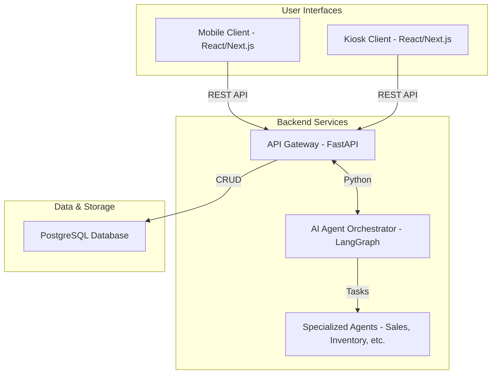
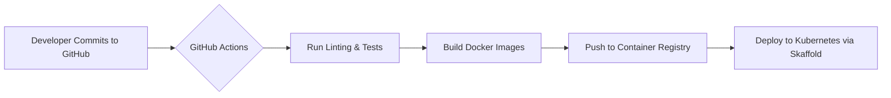

# Slide 1: Title Card

*Goal:* To introduce the project, its current version, and the team responsible for its architecture.

*Key Visual/Diagram Description:* A clean title slide with the project logo (if available), project name, version number, and author(s).

*Bullet Points:*
- **Project Name:** Agentic AI for Seamless Retail ("Cognitive Retail Brain")
- **Version:** 0.1.0 (Prototype Phase)
- **Date:** July 2024
- **Authors:** Jules (Principal Solutions Architect)

*Speaker Notes:* This document provides an executive-level overview of the "Cognitive Retail Brain" project. Our goal is to align all stakeholders on the current architecture, the technologies chosen, and the strategic vision for the platform's evolution. We'll cover the system from the frontend user experience down to the infrastructure it runs on.

---

# Slide 2: Executive Summary & Problem Statement

*Goal:* To articulate the business problem and present the project's high-level technical solution.

*Key Visual/Diagram Description:* A simple flow diagram showing a customer's disconnected journey (e.g., Mobile -> In-Store) versus the connected journey enabled by the "Cognitive Retail Brain."

*Bullet Points:*
- **The Problem:** Customers experience a "context gap" in omnichannel retail. Conversations and preferences started on one platform (e.g., a mobile app) are lost when they switch to another (e.g., an in-store kiosk), leading to a frustrating, disjointed experience.
- **The Solution:** A multi-agent AI system that maintains a persistent, unified user context across all retail touchpoints.
- **Business Impact:** This enhances customer satisfaction, enables intelligent, personalized recommendations, and ultimately drives sales by creating a truly seamless journey.

*Speaker Notes:* The core issue we're solving is context fragmentation. By centralizing conversation history and user data, our system acts as a persistent "brain" for the customer, ensuring our AI assistants are always informed and helpful, regardless of the interaction channel.

---

# Slide 3: High-Level Architecture

*Goal:* To provide a 30,000-foot view of the system's components and their interactions.

*Key Visual/Diagram Description:* The Mermaid diagram below illustrates the system's key components and data flows, from user interaction to backend processing.

*Bullet Points:*
- **Architectural Pattern:** A decoupled, service-oriented architecture (SOA) with a clear separation between the frontend client and the backend API.
- **Core Components:** A React/Next.js frontend, a FastAPI backend, a LangGraph-based AI agent orchestrator, and a PostgreSQL database.
- **Communication Flow:** Users interact with the frontend, which communicates with the backend via a REST API. The backend then processes requests, orchestrates AI agents, and persists data.

*Speaker Notes:* We chose this decoupled architecture for its flexibility and scalability. The frontend and backend can be developed, deployed, and scaled independently. At the heart of our system is the LangGraph orchestrator, which allows us to dynamically route tasks to the most appropriate AI agent.

---

# Slide 4: Frontend Specifications

*Goal:* To detail the technology stack and design patterns used for the user interface.

*Key Visual/Diagram Description:* A wireframe or component hierarchy diagram showing how UI elements are composed.

*Bullet Points:*
- **Framework:** React v19.2.0 & Next.js v16.0.1. This provides a robust foundation with Server-Side Rendering (SSR) for fast initial loads and excellent SEO.
- **Language & Styling:** TypeScript for type safety and maintainability, with Tailwind CSS v4 for a utility-first styling approach that enables rapid, consistent UI development.
- **State Management:** Primarily utilizes React's built-in state management hooks (`useState`, `useContext`). This lightweight approach is sufficient for the current application complexity and avoids unnecessary dependencies.
- **Rendering Strategy:** A hybrid model leveraging Next.js. Static content is pre-rendered, while dynamic, user-specific data is fetched on the client-side or rendered on the server, optimizing for performance and user experience.

*Speaker Notes:* Our frontend strategy prioritizes performance and developer experience. Next.js gives us the best of both worlds: fast, static pages and dynamic, interactive capabilities. The choice of TypeScript and Tailwind CSS ensures our codebase is scalable, maintainable, and easy to work on.

---

# Slide 5: Backend Logic & API Layer

*Goal:* To explain the technologies and architectural patterns powering the server-side application.

*Key Visual/Diagram Description:* A sequence diagram showing the lifecycle of an API request, from receipt to response, including agent orchestration.

*Bullet Points:*
- **Language & Framework:** Python with FastAPI. Chosen for its high performance, asynchronous capabilities (critical for I/O-bound AI/DB calls), and automatic interactive API documentation (Swagger/OpenAPI).
- **API Protocol:** A RESTful API design. This industry-standard approach ensures predictable, resource-based endpoints and simplifies frontend integration.
- **AI Orchestration:** We use LangGraph to model our multi-agent system as a stateful graph. A central "Router" agent receives requests and delegates them to specialized agents (e.g., Sales, Inventory) based on intent, enabling complex, context-aware workflows.
- **Modularity:** The backend is organized by feature (api, services, db), promoting separation of concerns and making the system easier to maintain and extend.

*Speaker Notes:* FastAPI was a strategic choice, providing performance comparable to Node.js while letting us leverage Python's rich AI/ML ecosystem. The use of LangGraph is our key innovation; it moves us beyond simple, stateless LLM calls to a sophisticated, stateful system that can handle complex, multi-step user interactions.

---

# Slide 6: Data Persistence & Storage

*Goal:* To outline the strategy for storing, managing, and accessing data.

*Key Visual/Diagram Description:* An Entity-Relationship Diagram (ERD) showing the core database tables (Users, Sessions, Conversations, CartItems) and their relationships.

*Bullet Points:*
- **Primary Database:** PostgreSQL. A robust, open-source relational database (OLTP) chosen for its reliability, data integrity (ACID compliance), and powerful querying capabilities.
- **Data Access:** SQLAlchemy is used as the Object-Relational Mapper (ORM). This abstracts away raw SQL queries, reduces boilerplate code, and helps prevent common security vulnerabilities like SQL injection.
- **Data Schema:** The schema is designed to be user-centric, with tables for user sessions, conversation history, and shopping carts. This structure is essential for maintaining context across user interactions.
- **Caching Strategy:** Currently, no dedicated caching layer (e.g., Redis) is implemented. All data is fetched directly from PostgreSQL. This is an identified area for future performance optimization.

*Speaker Notes:* We selected PostgreSQL for its proven track record in production systems. The current schema is optimized for our primary use case: quickly retrieving a user's entire interaction history to provide seamless context. While direct DB access is sufficient for the prototype, we plan to introduce a Redis caching layer to handle high-volume reads and further reduce latency.

---

# Slide 7: DevOps, Infrastructure & Security

*Goal:* To describe how the application is built, deployed, monitored, and secured.

*Key Visual/Diagram Description:* The Mermaid diagram below shows the CI/CD pipeline from code commit to deployment.

*Bullet Points:*
- **Containerization:** The entire application stack (Frontend, Backend, Database) is containerized using Docker and orchestrated via Docker Compose. This ensures environment consistency and simplifies local development.
- **CI/CD Pipeline:** GitHub Actions are used for continuous integration. The presence of `skaffold.yaml` indicates the architecture is ready for a transition to a continuous deployment model targeting a Kubernetes (K8s) cluster.
- **Infrastructure as Code:** The Docker and Skaffold configurations serve as a form of IaC, allowing us to define and manage our infrastructure programmatically.
- **Security:** Security is currently minimal in this prototype phase. API endpoints are open. Future work will involve implementing token-based authentication (e.g., JWT) and defining role-based access control.

*Speaker Notes:* Our DevOps philosophy is "automate everything." The containerized setup allows any developer to spin up the entire stack with one command. Our CI/CD pipeline is designed for a future state of continuous delivery to a cloud-native environment like Kubernetes, ensuring we can deploy changes rapidly and reliably.

---

# Slide 8: Future Roadmap & Scalability Strategy

*Goal:* To outline the plan for the project's future development and how the architecture will support growth.

*Key Visual/Diagram Description:* A timeline or roadmap graphic showing planned features and architectural improvements for the next 6-12 months.

*Bullet Points:*
- **Horizontal Scaling:** The stateless nature of the backend API and frontend servers allows us to scale horizontally by adding more containers. This is fully supported by a Kubernetes-based deployment.
- **Vertical Scaling:** The primary database (PostgreSQL) can be scaled vertically by increasing its CPU, RAM, and storage resources. For read-heavy workloads, we can introduce read replicas.
- **Upcoming Features:**
    1. **Implement Redis:** Introduce a caching layer to reduce database load and improve API response times.
    2. **Add Authentication:** Secure the API with OAuth2/JWT to manage user access.
    3. **Enhance CI/CD:** Build out the deployment pipeline with automated end-to-end testing and canary deployments.
- **Long-Term Vision:** Transition from a monolithic backend to a microservices architecture, where each AI agent could become its own independent service. This would improve resilience and allow for independent scaling of different functionalities.

*Speaker Notes:* This architecture was designed with scalability in mind. Our immediate priority is to enhance performance and security by adding a caching layer and authentication. Looking further ahead, the modular design of our backend provides a clear path to a microservices architecture, ensuring the system can evolve to meet future demands.
