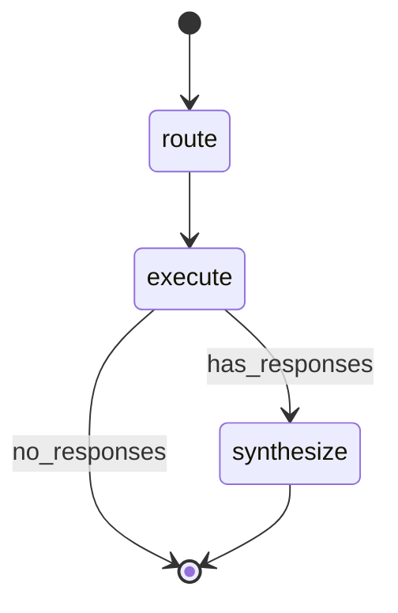

# Agent Orchestration

```mermaid
flowchart TB
    subgraph ENTRY["Entry Point"]
        QUERY[User Query]
    end

    subgraph ROUTING["Meta Router"]
        CLASSIFY[Intent Classification]
        SELECT[Lobe Selection]
    end

    subgraph LOBES["Cognitive Lobes"]
        direction TB
        
        INV[Inventory Lobe<br/>Stock prediction]
        EMP[Empathy Lobe<br/>Customer chat]
        VIS[Visual Lobe<br/>Image search]
        CODE[Code Lobe<br/>Automation]
        REC[Recommendation<br/>Personalization]
    end

    subgraph PARALLEL["Parallel Execution"]
        EXEC[Async Gather]
    end

    subgraph SYNTHESIS["Response Synthesis"]
        COMBINE[Combine Results]
        RANK[Rank by Confidence]
        FORMAT[Format Response]
    end

    QUERY --> CLASSIFY
    CLASSIFY --> SELECT
    
    SELECT -->|primary| EMP
    SELECT -->|parallel| INV
    SELECT -->|parallel| REC
    
    INV --> EXEC
    EMP --> EXEC
    REC --> EXEC
    VIS -.->|if image| EXEC
    CODE -.->|if code| EXEC
    
    EXEC --> COMBINE
    COMBINE --> RANK
    RANK --> FORMAT
    FORMAT --> RESPONSE[Final Response]

    style ROUTING fill:#1a1a2e,stroke:#e94560
    style LOBES fill:#16213e,stroke:#00d9ff
    style PARALLEL fill:#0f3460,stroke:#00ff88
```

## LangGraph State Flow

## Lobe Responsibilities

| Lobe | Trigger Keywords | Backend |
|------|------------------|---------|
| Inventory | stock, available, warehouse | Brain API |
| Empathy | help, hello, thank you | vLLM |
| Visual | image, photo, similar | CLIP/Triton |
| Code | code, function, script | StarCoder2 |
| Recommendation | suggest, trending, gift | Customlogic |
