# Architecture Overview

```mermaid
flowchart TB
    subgraph SENSORY["Sensory Cortex"]
        direction LR
        VIS[Visual Pathway<br/>YOLOv9/CLIP]
        AUD[Audio Pathway<br/>Whisper]
        DIG[Digital Pathway<br/>API Gateway]
    end

    subgraph MEMORY["Hippocampus"]
        direction LR
        VEC[(Vector Store<br/>ChromaDB)]
        GRAPH[(Knowledge Graph<br/>Neo4j)]
        CACHE[(Session Cache<br/>Redis)]
    end

    subgraph TRAINING["Cerebellum"]
        direction LR
        TRAIN[Training Pipeline<br/>QLoRA/PEFT]
        MLFLOW[MLflow<br/>Tracking]
    end

    subgraph REASONING["Frontal Cortex"]
        direction TB
        META[Meta Router]
        
        subgraph LOBES["Cognitive Lobes"]
            INV[Inventory]
            EMP[Empathy]
            VISN[Visual]
            CODE[Code]
            REC[Recommendation]
        end
    end

    subgraph INFERENCE["Synapse"]
        direction LR
        TRITON[Triton<br/>Vision Models]
        VLLM[vLLM<br/>High Throughput]
        LOCAL[llama.cpp<br/>CPU/Edge]
    end

    subgraph GATEWAY["API Gateway"]
        FAST[FastAPI<br/>OpenTelemetry]
    end

    VIS --> META
    AUD --> META
    DIG --> META
    
    META --> INV
    META --> EMP
    META --> VISN
    META --> CODE
    META --> REC
    
    INV --> TRITON
    EMP --> VLLM
    VISN --> TRITON
    CODE --> LOCAL
    REC --> VLLM
    
    TRITON --> FAST
    VLLM --> FAST
    LOCAL --> FAST
    
    VEC <--> META
    GRAPH <--> META
    CACHE <--> FAST
    
    TRAIN --> MLFLOW
    MLFLOW --> VLLM

    style SENSORY fill:#1a1a2e,stroke:#e94560
    style MEMORY fill:#16213e,stroke:#0f3460
    style TRAINING fill:#0f3460,stroke:#e94560
    style REASONING fill:#1a1a2e,stroke:#00d9ff
    style INFERENCE fill:#16213e,stroke:#00ff88
    style GATEWAY fill:#e94560,stroke:#fff
```

## Component Summary

| Layer | Components | Purpose |
|-------|------------|---------|
| Sensory | YOLOv9, Whisper, API | Input processing |
| Memory | ChromaDB, Neo4j, Redis | Context and retrieval |
| Training | QLoRA, MLflow | Model fine-tuning |
| Reasoning | Meta Router, Lobes | Intent classification and routing |
| Inference | Triton, vLLM, llama.cpp | Model serving |
| Gateway | FastAPI | External API |
