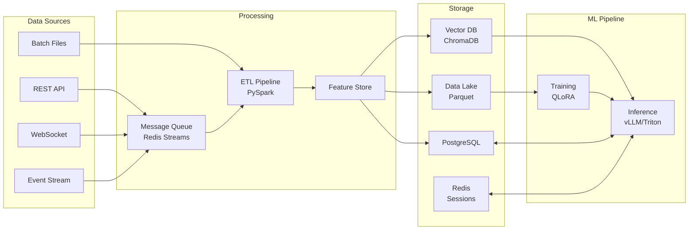

# Data Flow

## Data Stores

| Store | Type | Use Case |
|-------|------|----------|
| Parquet | Data Lake | Training data, analytics |
| ChromaDB | Vector | Semantic search, RAG |
| PostgreSQL | Relational | Products, orders, users |
| Redis | Key-Value | Sessions, cache, queues |
