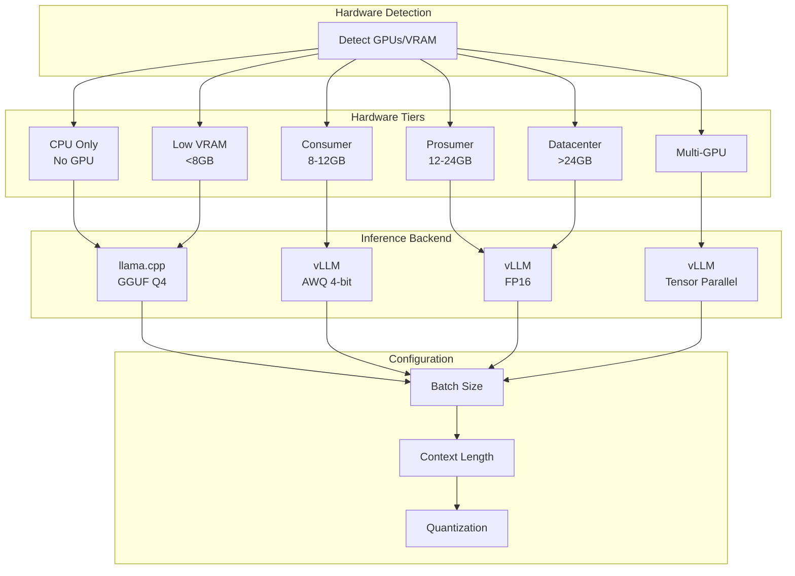

# Hardware Scaling



## Tier Configuration

| Tier | GPUs | VRAM | Backend | Quantization | Batch | Context |
|------|------|------|---------|--------------|-------|---------|
| CPU Only | 0 | - | llama.cpp | Q4_K_M | 1 | 2048 |
| Low VRAM | 1 | <8GB | llama.cpp | Q4_K_M | 1 | 4096 |
| Consumer | 1 | 8-12GB | vLLM | AWQ | 8 | 8192 |
| Prosumer | 1 | 12-24GB | vLLM | FP16 | 32 | 16384 |
| Datacenter | 1 | >24GB | vLLM | BF16 | 128 | 32768 |
| Multi-GPU | 2+ | any | vLLM+TP | FP16 | 128 | 32768 |

## Brain Power Formula

```
score = total_vram × 10 × (1 + (gpu_count - 1) × 0.8)
```

More GPUs = exponentially more brain power.
