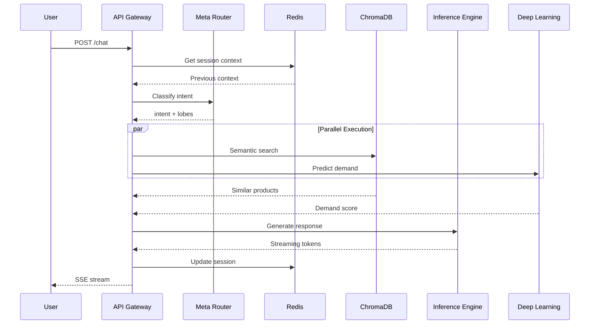

# Inference Flow

## Request Lifecycle

1. User sends chat message
2. Gateway retrieves session context from Redis
3. Meta Router classifies intent
4. Router selects cognitive lobes
5. Lobes execute in parallel:
   - Vector search for relevant products
   - Brain predicts demand signals
6. LLM generates response using context
7. Response streams back to user
8. Session state updated in cache
